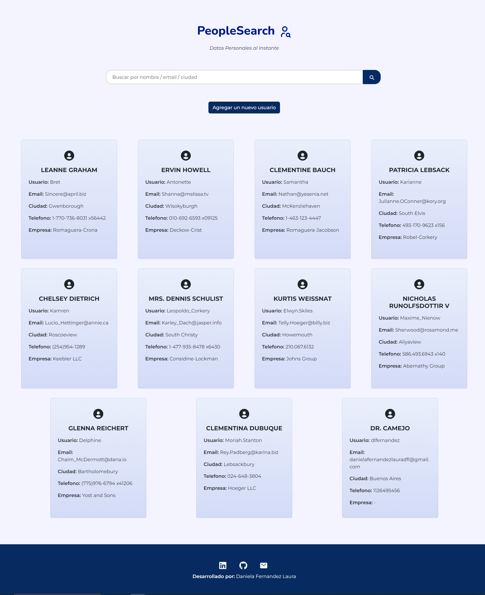

# Challenge FORIT - PeopleSearch

Este proyecto fue desarrollado para el Challenge de FORIT. Es un proyecto frontend desarrollado con Vite para consumir y mostrar datos de una API externa. Permite buscar, filtrar y agregar nuevos usuarios

### Instalacion
1. Clona el repositorio:
    ```
    git clone https://github.com/Ariana-Seok/peoplesearch-forit.git
    ```

2. Dirijase al directorio del proyecto:
    ```
    cd peoplesearch-forit
    ```

3. Instalar dependencias
    ```
    npm i
    ```

4. Iniciar la Aplicacion
    ```
    npm run dev
    ```

### Captura de pantalla



### Tecnologías utilizadas
- Vite
- React
- Bootstrap
- Formik
  
